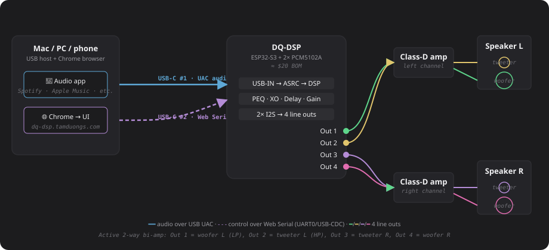

# DQ-DSP — Web UI

### 🎥 [**Watch the demo**](https://youtu.be/UXzky9iujUc)  ·  📝 [**Full write-up & build story**](https://tamduongs.com/blog/dq-dsp)  ·  👉 [**Live UI**](https://dq-dsp.tamduongs.com)  ·  🔥 [**Firmware repo**](https://github.com/agooddaytowork/dq-dsp-firmware)  ·  📦 [**Pre-built v1.0.0 binary**](https://github.com/agooddaytowork/dq-dsp-firmware/releases/tag/v1.0.0)

Real-time control surface for **DQ-DSP** — an ESP32-S3 USB Audio Class
device with a 2-in / 4-out parametric pipeline. Parameter edits stream
to the device live over Web Serial; presets live in the browser's
localStorage and can be exported as JSON or committed to the device's
flash.

> *(DQ = my daughter's name. Yes, I named a DSP after her. Don't @ me.)*

> **📝 [The full story →](https://tamduongs.com/blog/dq-dsp)** —
> *why an active speaker, what I tried first (a Wondom ADAU1701 board, a
> failed attempt to ship a miniDSP into Vietnam), and the complete $20
> build journey with photos. This README is the technical reference for
> the UI; the blog is the narrative.*

### ▶ Video demo

*Me, the dev-board, two purple PCM5102As, and a bookshelf speaker pair, in one shot.*

## What do I actually do with this?

Plug an ESP32-S3 dev-board with two PCM5102A breakouts soldered in into
your laptop. Your OS sees a generic USB audio device showing up as
**usb uac** in the audio picker (that's the UAC interface descriptor
the upstream TinyUSB component ships — feel free to rename it to
*DQ-DSP* in your OS sound settings if you want). Open this UI in Chrome
on the same laptop, click **Connect Serial**, and now every PEQ knob
you drag goes straight into the chip — no recompile, no MIDI, no $400
miniDSP.

### The use case I actually built it for: active 2-way speakers

Bookshelf speakers are usually passive — the crossover is a chunk of
inductors and capacitors inside the cab. Active bi-amp rips that out
and feeds each driver its own amp, with the crossover done in DSP.
DQ-DSP makes it a $20 BOM:

| DSP output | Drives        | Typical settings                          |
|------------|---------------|-------------------------------------------|
| Out 1      | Left woofer   | LP @ XO freq, LR4 24 dB/oct               |
| Out 2      | Left tweeter  | HP @ XO freq, LR4 24 dB/oct, optional delay |
| Out 3      | Right tweeter | mirror of Out 2 via link group            |
| Out 4      | Right woofer  | mirror of Out 1 via link group            |

Pick the crossover frequency off the driver's spec sheet (usually
1.5–3 kHz for a 1" dome / 5" mid), trim gain, time-align with delay,
and notch out the room with the Room EQ tab. Save preset → click
**Save to Device** → unplug → the box keeps playing forever.

The reference build I drive with this UI: **Dayton Audio NHP25Ti-4**
(1" titanium dome) on top + **Dayton Audio TCP115-4** (5" paper-cone)
on the bottom. Crossed over around 2 kHz with LR4 24 dB/oct. Photos and
the full story are in the [blog write-up](https://tamduongs.com/blog/dq-dsp).

## Features

- **2 inputs × 4 outputs**, 10-band parametric EQ on every channel
- **Room EQ** stage with REW measurement import + auto-EQ against
  flat / Harman / tilt targets
- **2 × 4 routing matrix** with per-crosspoint linear gain
- **Per-output**: gain · mute · phase · 0–10 ms delay · 10-band PEQ
  · crossover (LR / Butterworth, 6/12/18/24 dB/oct)
- **Flexible link groups** — any-to-any output mirroring
- **Live clock-drift compensation (ASRC)** with tunable PI controller
- Per-channel CPU-load + buffer-fill telemetry charts
- **Liquid Glass** UI in light + dark
- Full keyboard accessibility, theme-aware tooltips with REW export
  step-by-step instructions baked into the Import REW button

## Demo notes

Open <https://dq-dsp.tamduongs.com> in **Chrome / Edge / Brave / Opera
on desktop** to actually push parameters to a connected device. On
mobile, Firefox, or Safari you can still browse the UI — Web Serial
just isn't exposed there, and a banner says so.

No hardware? You can still drag PEQ bands, swap routing, load presets,
and watch the response chart redraw. Everything except the live device
push works offline.

## Run locally

    npm install
    npm run dev

Build for production:

    npm run build

The build is a static SPA in `dist/` — drop it on any static host.

## Deploying to Vercel

The UI is a stock Vite + React project. On Vercel: **New Project →
Import** the GitHub repo and accept the auto-detected defaults
(`npm install` / `npm run build` / `dist/`). The build script reads
`package.json#version` and `git rev-parse --short HEAD` at compile
time and surfaces them in the AppFooter, so each deploy shows the
exact commit it was built from.

## Hardware companion

Firmware lives at
[`agooddaytowork/dq-dsp-firmware`](https://github.com/agooddaytowork/dq-dsp-firmware).
The wire-protocol contract is documented there in
`shared/dsp/serial_protocol.h`. The TypeScript decoder in
`src/types/serial-protocol.ts` is a direct mirror.

### Bill of materials

| # | Part | Qty | Notes |
|---|------|-----|-------|
| 1 | **ESP32-S3-DevKitC-1 N16R8** | 1 | 16 MB flash + 8 MB Octal PSRAM, 38-pin Espressif dev-board. |
| 2 | **GY-PCM5102 / TENSTAR ROBOT PCM5102A** breakout | 2 | Purple board, 3.5 mm jack + L/R/G analog pads. |
| 3 | USB-C data cable | 2 | DevKitC-1 has two USB-C ports — **USB-Serial-JTAG** (UART0, used for flashing AND web-UI control) and **native USB-OTG** (used for UAC audio). Both stay plugged in during normal use; both must be data-capable. |
| 4 | Dupont jumper wires (M-F) | ≥ 12 | 3 I2S signals × 2 DACs + shared power = 8 min + a few for the jumper pads. |
| 5 | 3.5 mm audio cable / pigtail | 2 | One per DAC, into amp or powered speakers. |

Roughly **US $15–20** end-to-end. Pre-built firmware binary lives on the
firmware repo's [v1.0.0 release](https://github.com/agooddaytowork/dq-dsp-firmware/releases/tag/v1.0.0)
— flash, plug in, and the UI sees it.

### Wiring

| Function           | ESP32-S3 GPIO |
|--------------------|---------------|
| I2S0 BCK (DAC #1)  | 4             |
| I2S0 LRCK          | 5             |
| I2S0 DOUT          | 6             |
| I2S1 BCK (DAC #2)  | 16            |
| I2S1 LRCK          | 17            |
| I2S1 DOUT          | 18            |

Both DACs share 3V3 + GND. On each PCM5102A breakout:
**XSMT → 3V3** (un-mute — default jumper position is LOW = silence),
**SCK → GND** (chip generates MCLK internally from BCK),
FLT / DEMP / FMT default LOW.

## Support the project

If DQ-DSP is useful to you and you want to chip in for hardware
prototypes, parts, or coffee while the next firmware version cooks,
buy me a Ko-fi:

Anything is appreciated and goes straight into the build.

## License

[GPLv3](./LICENSE). Forks and derivatives must remain open-source under
the same terms.

Copyright © 2026 Tam Duong (<https://tamduongs.com/>).
