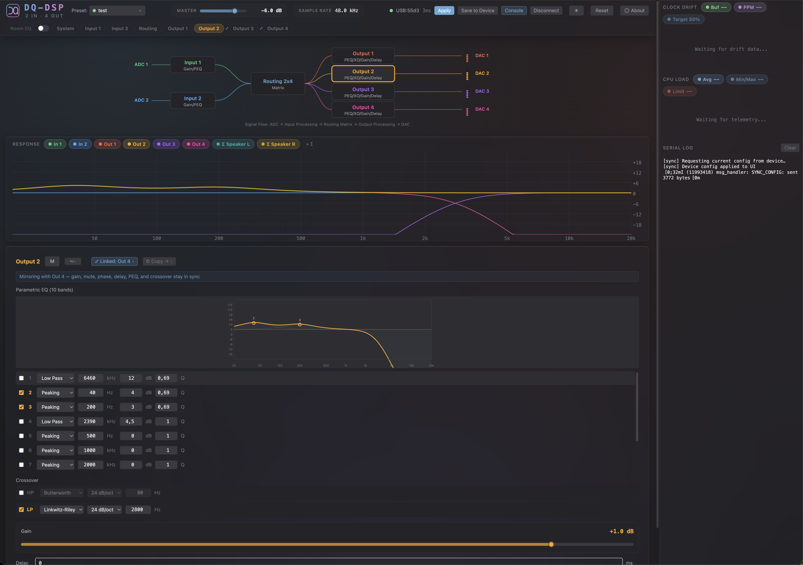

# DQ-DSP — Web UI

Real-time control surface for the **DQ-DSP** audio DSP — an ESP32-S3
USB Audio Class device with a 2-in / 4-out parametric pipeline.
Parameter edits stream to the device live over Web Serial; presets live
in the browser's localStorage and can be exported as JSON or committed
to the device's flash.

> **DQ** stands for **Dương Quỳnh** — the author's daughter.

## Features

- **2 inputs × 4 outputs**, 10-band parametric EQ on every channel
- **Room EQ** stage with REW measurement import + auto-EQ against
  flat / Harman / tilt targets
- **2 × 4 routing matrix** with per-crosspoint linear gain
- **Per-output**: gain · mute · phase · 0–10 ms delay · 10-band PEQ
  · crossover (LR / Butterworth, 6/12/18/24 dB/oct)
- **Flexible link groups** — any-to-any output mirroring
- **Live clock-drift compensation (ASRC)** with tunable PI controller
- Per-channel CPU-load + buffer-fill telemetry charts
- **Liquid Glass** UI in light + dark
- Full keyboard accessibility, theme-aware tooltips with REW export
  step-by-step instructions baked into the Import REW button

## Live demo

Coming soon at `https://dq-dsp.vercel.app` once the firmware repo is
ready and the demo hardware is wired up.

> Web Serial requires **Chrome / Edge / Brave / Opera on desktop**. The
> UI auto-detects unsupported browsers (Firefox, Safari, mobile) and
> shows a banner explaining why the Connect button is disabled.

## Run locally

    npm install
    npm run dev

Build for production:

    npm run build

The build is a static SPA in `dist/` — drop it on any static host.

## Deploying to Vercel

The UI is a stock Vite + React project. On Vercel: **New Project →
Import** the GitHub repo and accept the auto-detected defaults
(`npm install` / `npm run build` / `dist/`). The build script reads
`package.json#version` and `git rev-parse --short HEAD` at compile
time and surfaces them in the AppFooter, so each deploy shows the
exact commit it was built from.

## Hardware companion

Firmware lives at
[`agooddaytowork/dq-dsp-firmware`](https://github.com/agooddaytowork/dq-dsp-firmware).
The wire-protocol contract is documented there in
`shared/dsp/serial_protocol.h`. The TypeScript decoder in
`src/types/serial-protocol.ts` is a direct mirror.

## License

[GPLv3](./LICENSE). Forks and derivatives must remain open-source under
the same terms.

Copyright © 2026 Tam Duong (<https://tamduongs.com/>).
