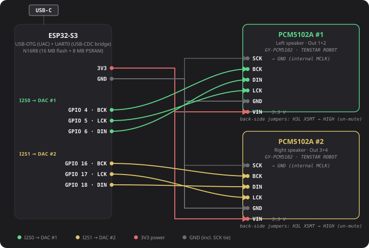

# DQ-DSP — ESP32-S3 Firmware

### 👉 [**Try the live UI: dq-dsp.tamduongs.com**](https://dq-dsp.tamduongs.com)  ·  📦 [**Pre-built binaries (v1.0.0)**](https://github.com/agooddaytowork/dq-dsp-firmware/releases/tag/v1.0.0)  ·  🖥 [**UI source**](https://github.com/agooddaytowork/dq-dsp-ui)

USB Audio Class 1.0 → on-device DSP → dual I2S out for two PCM5102A
breakouts. Pairs with the **DQ-DSP web UI** for live parameter control
over the same USB cable (CDC-ACM).

> *(DQ = my daughter's name. Yes, I named a DSP after her. Don't @ me.)*

[](https://dq-dsp.tamduongs.com)

## Audio path

```
USB host  →  TinyUSB UAC ring buffer  →  ASRC (PI controller, ±1400 ppm)
          →  DSP pipeline (Core 1):
              input gain · phase · mute
              10-band Room EQ ×2 ch
              10-band Input PEQ ×2 ch
              2 × 4 routing matrix
              10-band Output PEQ ×4 ch
              crossover (HP + LP, LR / Butterworth, 6/12/18/24 dB/oct)
              gain · delay (0–10 ms) · phase · mute
          →  Dual I2S TX  →  2 × PCM5102A  →  4 line outs
```

CDC-ACM on the same USB cable carries control frames (SLIP + CRC-8) for
the web UI's live parameter streaming, bulk Apply, and NVS Save-to-Device.

## Bill of materials

| # | Part | Qty | Notes |
|---|------|-----|-------|
| 1 | **ESP32-S3-DevKitC-1 N16R8** | 1 | 16 MB flash + 8 MB Octal PSRAM. Standard 38-pin Espressif dev-board (also sold by Waveshare, AliExpress clones, etc.). |
| 2 | **GY-PCM5102 / TENSTAR ROBOT PCM5102A** breakout | 2 | Purple board with 3.5 mm jack on the long edge and L/R/G analog pads. ~$2 each on AliExpress. |
| 3 | USB-C data cable | 1 | Carries audio + serial. *Make sure it's a data cable, not power-only.* |
| 4 | Dupont jumper wires (M-F) | ≥ 12 | 3 I2S signals × 2 DACs + shared 3V3 + GND = 8 minimum, plus a couple spares for the jumper pads. |
| 5 | 3.5 mm audio cable / pigtail | 2 | One per DAC, into your amp or powered speakers. |

Total parts cost: roughly **US $15–20** at the time of writing. ESP-IDF
v5.2 toolchain is the only software dependency.

## Wiring



| Function           | ESP32-S3 GPIO |
|--------------------|---------------|
| I2S0 BCK (DAC #1)  | 4             |
| I2S0 LRCK          | 5             |
| I2S0 DOUT          | 6             |
| I2S1 BCK (DAC #2)  | 16            |
| I2S1 LRCK          | 17            |
| I2S1 DOUT          | 18            |

Both DACs share **3V3** + **GND**. On each PCM5102A breakout:
- **XSMT** → 3V3 (un-mute — default jumper position is LOW = silence)
- **SCK** → GND (chip generates MCLK internally from BCK)
- FLT / DEMP / FMT → default LOW

Pin assignments are overridable via `idf.py menuconfig` →
*Audio DSP I2S Configuration (ESP32-S3)*.

## Just want the binary?

Grab the pre-built one from the [v1.0.0 release](https://github.com/agooddaytowork/dq-dsp-firmware/releases/tag/v1.0.0)
and flash it in one shot:

    python -m esptool --chip esp32s3 -b 460800 \
      --before default_reset --after hard_reset \
      write_flash 0x0 dq-dsp-firmware-1.0.0.bin

Then plug the board into a Mac / PC, [open the UI](https://dq-dsp.tamduongs.com)
in Chrome, click **Connect Serial**, pick the DQ-DSP port, and start tweaking.

## Build from source

ESP-IDF v5.x required. Set up per
<https://docs.espressif.com/projects/esp-idf/en/stable/esp32s3/get-started/>.

    . $IDF_PATH/export.sh
    idf.py set-target esp32s3
    idf.py build
    idf.py flash monitor

The included `./idf.sh` is a convenience wrapper.

`sdkconfig.defaults` pins the project-specific Kconfig values; the
generated `sdkconfig` is gitignored (user-local).

## Repository layout

    .
    ├── main/               # ESP-IDF component
    │   ├── main.c          # app_main: init NVS / DSP / I2S / USB
    │   ├── usb_audio.c     # TinyUSB UAC + CDC, ASRC PI controller
    │   ├── i2s_audio.c     # Dual I2S TX driver
    │   ├── serial_server.c # CDC frame parser → dsp_param_apply
    │   ├── Kconfig.projbuild
    │   └── CMakeLists.txt
    ├── shared/dsp/         # Pure-C DSP core
    │   ├── dsp_config.h
    │   ├── dsp_pipeline.c  # Biquad chain, routing matrix, crossover
    │   ├── dsp_param_update.c   # Atomic shadow-buffer swap
    │   ├── msg_handler.c   # Wire-protocol dispatch
    │   ├── serial_protocol.h    # Canonical frame layout (mirrored in UI repo)
    │   └── ble_protocol.h  # Header-compat constants (BLE transport removed at runtime)
    ├── CMakeLists.txt
    ├── partitions.csv
    ├── sdkconfig.defaults
    └── dependencies.lock

## Wire protocol

`shared/dsp/serial_protocol.h` is the canonical definition. Frame layout:

    0xAA 0x55 | length (1 byte) | payload | CRC-8 (poly 0x07)

The UI's TypeScript decoder lives at
[`src/types/serial-protocol.ts`](https://github.com/agooddaytowork/dq-dsp-ui/blob/main/src/types/serial-protocol.ts)
in the companion repo and is a one-to-one mirror.

## Web UI companion

UI source: <https://github.com/agooddaytowork/dq-dsp-ui>. Live deploy:
<https://dq-dsp.tamduongs.com>. Connect via Web Serial on Chrome / Edge /
Brave / Opera desktop — the UI auto-detects unsupported browsers
(Firefox, Safari, mobile) and shows a banner.

## Support the project

If DQ-DSP is useful to you and you want to chip in for hardware
prototypes, parts, or coffee while the next firmware version cooks,
buy me a Ko-fi:

[](https://ko-fi.com/tamdnq)

Anything is appreciated and goes straight into the build.

## License

[GPLv3](./LICENSE). ESP-IDF and its components are Apache 2.0; combined
binaries inherit GPL terms (one-way compatible). Forks and derivatives
of this firmware must remain open-source under the same license.

Copyright © 2026 Tam Duong (<https://tamduongs.com/>).
