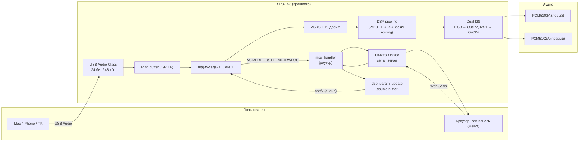
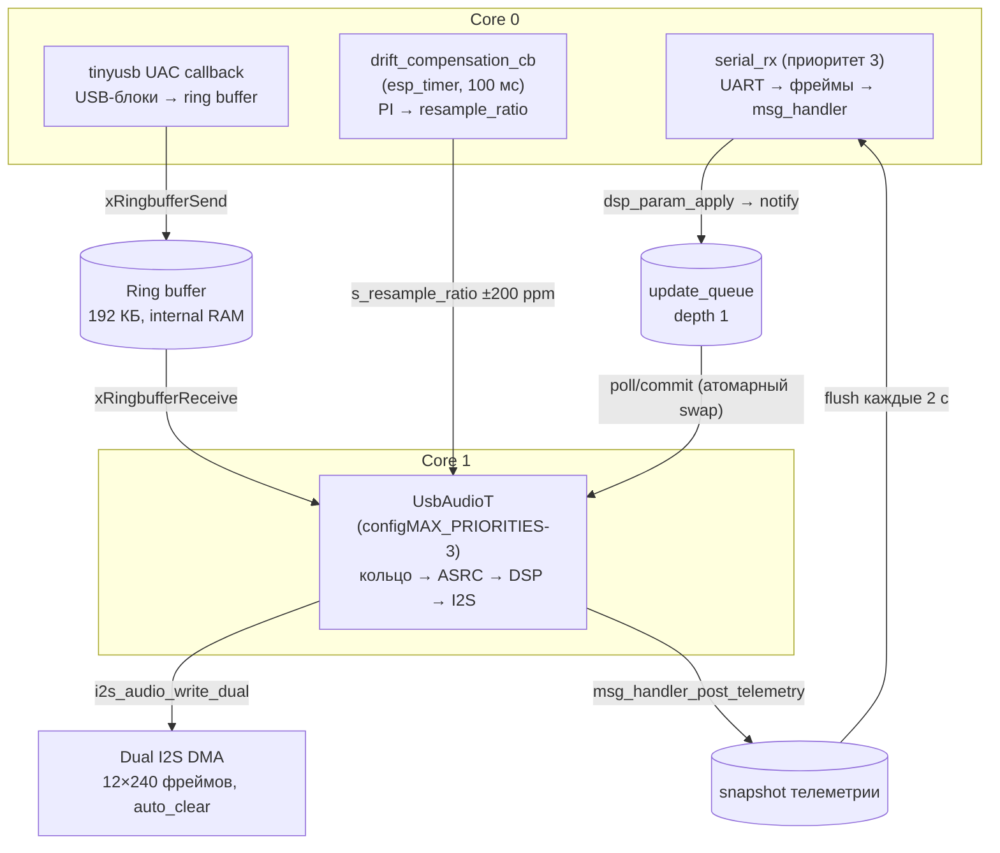
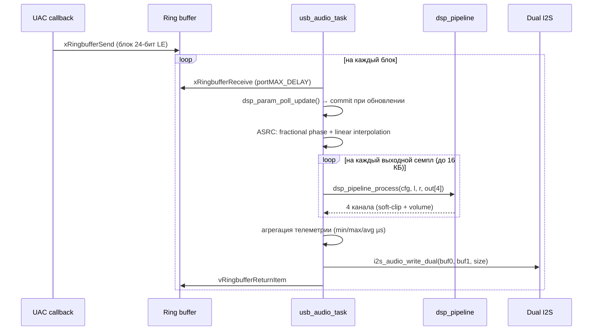
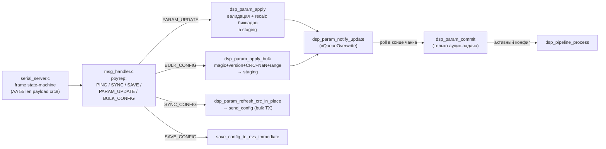
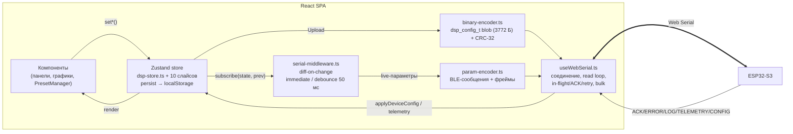

# DQ-DSP — Полное техническое руководство

**DQ-DSP** — это 2-входовый / 4-выходовый цифровой аудиопроцессор на ESP32-S3 с
веб-панелью управления. Звук приходит по USB Audio Class (24 бит / 48 кГц),
обрабатывается DSP-конвейером (фильтры, кросоверы, задержки, маршрутизация) и
выводится на два независимых стерео-ЦАП через dual I2S.

Документ покрывает весь жизненный цикл: от понимания архитектуры до сборки,
прошивки, разработки, использования и отладки. Рассчитан и на новых
разработчиков, и на пользователей.

---

## Содержание

- [1. Обзор проекта](#1-обзор-проекта)
  - [1.1 Возможности](#11-возможности)
  - [1.2 Аппаратная и программная платформа](#12-аппаратная-и-программная-платформа)
  - [1.3 Структура репозитория](#13-структура-репозитория)
  - [1.4 Глоссарий](#14-глоссарий)
- [2. Архитектура](#2-архитектура)
  - [2.1 Общая схема](#21-общая-схема)
  - [2.2 Прошивка: задачи, ядра и аудио-путь](#22-прошивка-задачи-ядра-и-аудио-путь)
  - [2.3 Прошивка: путь управления](#23-прошивка-путь-управления)
  - [2.4 Веб-интерфейс: слои и поток данных](#24-веб-интерфейс-слои-и-поток-данных)
  - [2.5 Wire-протокол: краткая справка](#25-wire-протокол-краткая-справка)
  - [2.6 Ключевые архитектурные решения](#26-ключевые-архитектурные-решения)
  - [2.7 Известные ограничения](#27-известные-ограничения)
- [3. Установка и настройка окружения](#3-установка-и-настройка-окружения)
  - [3.1 Предварительные требования](#31-предварительные-требования)
  - [3.2 Прошивка: установка ESP-IDF](#32-прошивка-установка-esp-idf)
  - [3.3 Прошивка: сборка, прошивка, мониторинг](#33-прошивка-сборка-прошивка-мониторинг)
  - [3.4 Веб-интерфейс: установка и запуск](#34-веб-интерфейс-установка-и-запуск)
  - [3.5 Настройка конфигурации (menuconfig)](#35-настройка-конфигурации-menuconfig)
  - [3.6 Чек-лист первого запуска](#36-чек-лист-первого-запуска)
- [4. API, классы и ключевые функции](#4-api-классы-и-ключевые-функции)
  - [4.1 Прошивка: dsp_param_update.h](#41-прошивка-dsp_param_updateh)
  - [4.2 Прошивка: msg_handler.h](#42-прошивка-msg_handlerh)
  - [4.3 Прошивка: dsp_pipeline, serial, usb_audio, i2s_audio](#43-прошивка-dsp_pipeline-serial-usb_audio-i2s_audio)
  - [4.4 Веб-интерфейс: useWebSerial](#44-веб-интерфейс-usewebserial)
  - [4.5 Веб-интерфейс: param-encoder и serial-protocol](#45-веб-интерфейс-param-encoder-и-serial-protocol)
  - [4.6 Веб-интерфейс: бинарный кодек конфига](#46-веб-интерфейс-бинарный-кодек-конфига)
  - [4.7 Веб-интерфейс: store и middleware](#47-веб-интерфейс-store-и-middleware)
  - [4.8 Примеры кода](#48-примеры-кода)
- [5. Сценарии использования](#5-сценарии-использования)
  - [5.1 Пользователь: подключение и базовая работа](#51-пользователь-подключение-и-базовая-работа)
  - [5.2 Настройка DSP-блоков](#52-настройка-dsp-блоков)
  - [5.3 Пресеты: сохранение, импорт, экспорт](#53-пресеты-сохранение-импорт-экспорт)
  - [5.4 Разработчик: добавить новый параметр](#54-разработчик-добавить-новый-параметр)
  - [5.5 Разработчик: проверить выходы 3 и 4](#55-разработчик-проверить-выходы-3-и-4)
  - [5.6 Примеры конфигурации](#56-примеры-конфигурации)
- [6. Troubleshooting и FAQ](#6-troubleshooting-и-faq)
  - [6.1 Сборка и прошивка](#61-сборка-и-прошивка)
  - [6.2 Подключение и звук](#62-подключение-и-звук)
  - [6.3 Веб-интерфейс](#63-веб-интерфейс)
  - [6.4 FAQ](#64-faq)
- [7. Ссылки](#7-ссылки)

---

## 1. Обзор проекта

Проект состоит из двух частей:

- **`dq-dsp-firmware`** — прошивка на ESP-IDF (язык C): USB-аудио вход,
  DSP-конвейер в реальном времени, dual I2S выход, serial-управление.
- **`dq-dsp-ui`** — веб-панель (React + TypeScript + Vite): визуальная настройка
  всех параметров DSP, пресеты, импорт/экспорт конфигурации, live-телеметрия.

Связь между ними — **Web Serial** (браузер → UART0 платы, 115200 8N1).

### 1.1 Возможности

| Область | Что умеет |
|---|---|
| Вход | USB Audio Class 1.0, 24 бит / 48 кГц, стерео |
| Выход | 2 × стерео ЦАП (PCM5102A): каналы 1–4 (Out1/2 → I2S0, Out3/4 → I2S1) |
| DSP | 10-полосный PEQ на вход/выход, 10-полосный Room EQ на вход, кросоверы HP/LP (Butterworth / Linkwitz-Riley, 12/24/48 дБ/окт), задержка до ~20 мс (960 сэмплов при 48 кГц), инверсия фазы, мягкий клиппинг |
| Маршрутизация | Матрица 2×4 с включением и гейном на кросс-пойнт; пресеты stereo / mono |
| Управление | Live-параметры по serial (diff-движок), bulk-загрузка полного конфига (3772 Б, CRC-32), телеметрия, логи |
| Пресеты | Сохранение в localStorage, экспорт/импорт JSON, сохранение конфига на устройство (NVS) |
| Room EQ | Импорт измерения REW (`.txt`/`.csv`), сглаживание, целевые кривые (flat/harman/tilt) |
| ASRC | Асинхронная передискретизация с PI-компенсацией дрейфа USB↔I2S (±ppm) |

### 1.2 Аппаратная и программная платформа

| Компонент | Версия / значение |
|---|---|
| MCU | ESP32-S3 (N16R8: dual-core Xtensa LX7 @ 240 МГц, 16 МБ flash, 8 МБ PSRAM) |
| Вход | USB Audio Class 1.0, `CONFIG_UAC_SAMPLE_RATE = 48000` |
| Выход | I2S0 (GPIO 4/5/6) → левый ЦАП; I2S1 (GPIO 16/17/18) → правый ЦАП |
| ЦАП | 2 × PCM5102A (24 бит, Philips, 32-битные слоты) |
| ESP-IDF | 6.0.2, target `esp32s3` |
| UI | Node 22+, React 19, TypeScript 5.9, Vite 7, Zustand 5, Tailwind 4 |

### 1.3 Структура репозитория

```
dq-dsp/
├── dq-dsp-firmware/            # ESP-IDF проект
│   ├── main/
│   │   ├── main.c              # bootstrap: NVS, инициализация, запуск задач
│   │   ├── serial_server.c/.h  # UART0 транспорт, парсер фреймов, редирект ESP_LOG
│   │   ├── usb_audio.c/.h      # UAC вход, ring buffer, ASRC, PI-дрейф, аудио-задача
│   │   └── i2s_audio.c/.h      # dual I2S TX (2 × PCM5102A)
│   ├── shared/dsp/
│   │   ├── dsp_config.h        # dsp_config_t (3772 Б) — контракт конфигурации
│   │   ├── dsp_pipeline.c/.h   # per-sample DSP обработка
│   │   ├── dsp_param_update.c/.h  # double-buffer параметров + коэффициенты биквадов
│   │   ├── msg_handler.c/.h    # транспорт-независимый роутер сообщений
│   │   ├── serial_protocol.h   # фрейминг + CRC-8 + control-сообщения
│   │   └── ble_protocol.h      # wire-формат BLE-совместимых сообщений
│   ├── components/usb_device_uac/  # vendored компонент UAC (espressif)
│   ├── sdkconfig.defaults      # CONFIG_UAC_SAMPLE_RATE=48000 и др.
│   └── main/Kconfig.projbuild  # GPIO I2S0/I2S1 (menuconfig)
├── dq-dsp-ui/                  # React SPA
│   └── src/
│       ├── store/              # dsp-store.ts + slices/ (Zustand)
│       ├── serial/             # serial-middleware.ts (diff → фреймы)
│       ├── hooks/              # useWebSerial.ts, useKeyboardShortcuts.ts, useSerialSupport.ts
│       ├── export/             # binary-encoder.ts, binary-decoder.ts, checksum.ts
│       ├── types/              # dsp.ts, esp32.ts, filter.ts, ble-protocol.ts, serial-protocol.ts
│       ├── dsp/                # biquad.ts, crossover.ts, frequency-response.ts, utils.ts
│       ├── ble/                # param-encoder.ts
│       ├── components/         # React-компоненты (панели, графики, PresetManager…)
│       ├── constants/          # defaults.ts, filter-options.ts
│       └── utils/              # preset-io.ts, rew-parser.ts
└── docs/                       # документация
```

### 1.4 Глоссарий

| Термин | Значение |
|---|---|
| **UAC** | USB Audio Class — USB-аудио устройство без драйверов |
| **ASRC** | Asynchronous Sample Rate Conversion — передискретизация под расхождение тактов USB и I2S |
| **PEQ** | Parametric Equalizer — параметрический эквалайзер |
| **XO** | Crossover — разделительный фильтр HP/LP |
| **DF-IIT** | Direct Form II Transposed — форма реализации биквада |
| **Ring buffer** | Кольцевой буфер (FreeRTOS) между USB и аудио-задачей |
| **Staging/active** | Двойной буфер конфига: запись в staging, переключение в active атомарно |
| **msg_id** | Однобайтовый номер сообщения для сопоставления ACK |
| **Bulk config** | Полная передача `dsp_config_t` одним блоком (15 фреймов) |

---

## 2. Архитектура

### 2.1 Общая схема



### 2.2 Прошивка: задачи, ядра и аудио-путь



Поток обработки одного аудио-чанка в `usb_audio_task`:



Ключевые свойства:

- Аудио-задача привязана к **Core 1** с приоритетом `configMAX_PRIORITIES - 3`;
  serial и PI-контроллер живут на **Core 0**.
- Конфигурация двойная: **staging** (пишет serial-задача) и **active** (читает
  аудио-задача). Переключение — атомарный обмен указателями, без блокировок в
  аудио-конвейере.
- Биквады DF-IIT «морфятся» под новые коэффициенты без сброса состояния
  (иначе были клики на каждое движение слайдера).
- ASRC + PI компенсируют расхождение тактов USB-хоста и I2S (типично ±100 ppm):
  PI корректирует `resample_ratio ≈ 1.0 ± max_ppm/1e6`.

### 2.3 Прошивка: путь управления



Роутер (`msg_handler`) транспорт-независим: транспорты (serial, при необходимости
BLE) реализуют `msg_transport_t` и вызывают `msg_handler_process()`. Внутри —
приём bulk-конфига по частям и снапшот телеметрии.

### 2.4 Веб-интерфейс: слои и поток данных



- **Store** — единый источник истины UI; слайсы изолируют домены (input, routing,
  output, global, preset, link, serial, room-eq, drift, custom-sum). Persist в
  localStorage с debounce 300 мс (переживает перезагрузку страницы).
- **Middleware** — подписка на изменения: дискретные параметры (mute, phase,
  enable) уходят сразу, непрерывные (gain, freq, Q, delay) — с debounce 50 мс на
  ключ. Echo-конфига с устройства подавляется флагом `isApplyingDeviceConfig()`.
- **useWebSerial** — надёжный транспорт: очереди с ограничением
  `MAX_IN_FLIGHT = 4`, таймауты ACK 300 мс, до 3 ретраев, PING каждые 5 с,
  PONG-таймаут 2 с, авто-реконнект 2 с, bulk TX/RX с таймаутом 5 с.

### 2.5 Wire-протокол: краткая справка

Полная спецификация — [`wire-protocol.md`](wire-protocol.md). Кратко:

**Serial-фрейм** (UART0, 115200, 8N1):

```
AA 55 | length (≤252) | payload | CRC-8 (poly 0x07, init 0)
```

**Control-сообщения** (payload длиной 1):

| Байт | Значение | Ответ устройства |
|---|---|---|
| `0xA0` | PING | PONG `0xA1` |
| `0xA1` | PONG | — |
| `0xA2` | SYNC_CONFIG | bulk-выгрузка конфига + ACK |
| `0xA3` | LOG | — (исходящее) |
| `0xA4` | TELEMETRY | — (исходящее, 24 Б) |
| `0xA5` | SAVE_CONFIG | ACK |

**PARAM_UPDATE** (7–10 Б payload): `[msg_id, 0x01, block, channel, param_type, param_index, value]`.
Блоки: INPUT `0x01`, OUTPUT `0x02`, ROUTING `0x03`, GLOBAL `0x04`, SYSTEM `0x05`.
Значение — f32 LE (4 Б) для gain/freq/Q/delay/volume, u8 (1 Б) для mute/phase/enable/type.
Пример: громкость канала −6 дБ → `AA 55 0A 07 01 02 01 01 00 CE 4D 00 3F C4`.

**BULK_CONFIG**: первый фрейм `[msg_id, 0x02, size_lo, size_hi, ...первые 248 Б]`,
далее — сырые чанки по 252 Б; итого 3772 Б (`dsp_config_t`). Защита: magic
`0x44535043`, version `4`, CRC-32 IEEE.

**ACK/ERROR**: `[msg_id, 0x80, status]` / `[msg_id, 0x82, status, detail]`.
Статусы: OK `0x00`, INVALID_PARAM `0x01`, OUT_OF_RANGE `0x02`, BUSY `0x03`, CRC_ERROR `0x04`.

### 2.6 Ключевые архитектурные решения

| Решение | Почему |
|---|---|
| Double buffer + атомарный указатель | аудио-задача читает конфиг без блокировок, параметры применяются мгновенно |
| Commit только из аудио-задачи | единый владелец переключения буферов, нет double-swap |
| Транспорт-независимый роутер (`msg_transport_t`) | serial и потенциальный BLE используют один парсер/валидатор |
| NVS-сохранение только по команде | запись flash глушит кэш инструкций на обоих ядрах → артефакты аудио |
| Морфинг биквадов без сброса состояния | сброс на каждое движение слайдера давал клики |
| Bulk-конфиг + CRC/version/NaN-валидация | целостная замена конфигурации с защитой от отравления NaN |
| Sample rate зафиксирован на этапе компиляции | коэффициенты биквадов зависят от Fs; расхождение → принудительный passthrough |

### 2.7 Известные ограничения

- **Sample rate**: устройство работает только на `CONFIG_UAC_SAMPLE_RATE`
  (48000). UI при несовпадении получает отказ и должен пересчитать коэффициенты.
- **Вход — стерео**: второй вход физически отсутствует (два аудиоканала USB),
  «inputs» — это L/R каналы.
- **Один транспорт**: BLE удалён; serial — единственный канал управления.
- **Авто-sync отключён**: конфигурация с устройства загружается только вручную
  («Load from device»), чтобы не затирать настройки пользователя после прошивки.
- Известные баги/риски — в `audit-2026-08.md` (§3) и разделе [6. FAQ](#64-faq).

---

## 3. Установка и настройка окружения

### 3.1 Предварительные требования

**Аппаратно:**

- Плата ESP32-S3 (например, DevKitC-1) с USB-кабелем, поддерживающим данные.
- Две платы PCM5102A (I2S DAC), подключённые к GPIO:
  - I2S0 (левый): BCK=4, LRCK=5, DIN=6;
  - I2S1 (правый): BCK=16, LRCK=17, DIN=18.
  (Пины настраиваются в `main/Kconfig.projbuild`.)

**Программно:**

| Компонент | Требование |
|---|---|
| ESP-IDF | 6.0.2, target `esp32s3` (в этом окружении — `C:\Users\Mi\Arduino\esp-idf-git\esp-idf`) |
| Python | 3.14 (в venv IDF) |
| Node.js | 22+ |
| npm | в паре с Node |
| Браузер | Chrome/Edge (Web Serial API; работает на `localhost`/HTTPS) |

### 3.2 Прошивка: установка ESP-IDF

1. Установить **ESP-IDF 6.0.2** по официальному гайду:
   <https://docs.espressif.com/projects/esp-idf/en/v6.0.2/esp32s3/get-started/>
   (Windows — Espressif-IDE или ручная установка + `install.ps1`).
2. Убедиться, что `idf.py` доступен после экспорта окружения.

> Примечание: репозиторий рассчитан на ESP-IDF 6; сборка на 5.x может не пройти.

### 3.3 Прошивка: сборка, прошивка, мониторинг

**Windows (PowerShell):**

```powershell
# 1. Экспорт окружения
& "C:\Users\Mi\Arduino\esp-idf-git\esp-idf\export.ps1" | Out-Null

# 2. Сборка (из корня проекта прошивки)
cd C:\Users\Mi\dq-dsp\dq-dsp-firmware
idf.py build
```

Ожидаемый успех: `Project build complete`. Инфо-сообщения (не ошибки):

- `CMake Warning ... component_validation.cmake:98` — нота tinyusb;
- `NOTE: ... BT_NIMBLE_MESH_PROVISIONER ... 'default 0' is not a valid bool` —
  замечания парсера Kconfig IDF 6;
- `bootloader 36% free`, `app ... 93% free`.

**Поиск COM-порта:**

```powershell
[System.IO.Ports.SerialPort]::GetPortNames()
```

**Прошивка** (устройство — обычно `COM10`):

```powershell
idf.py -p COM10 flash
```

или вручную через esptool:

```powershell
python -m esptool --chip esp32s3 -b 460800 --before default-reset --after hard-reset `
  write-flash --flash-mode dio --flash-size 16MB --flash-freq 80m `
  0x0 build\bootloader\bootloader.bin `
  0x8000 build\partition_table\partition-table.bin `
  0x10000 build\esp32s3_audio_dsp.bin
```

Признак успеха: `Hash of data verified.` для каждого образа и
`Hard resetting via RTS pin...`. Перед прошивкой закройте всё, что держит порт
(терминалы, подключение в UI, аудиоплеер).

**Мониторинг логов:**

```powershell
idf.py -p COM10 monitor
```

**Linux/macOS:** используйте `idf.sh` в корне прошивки (обновите пути под своё
окружение):

```bash
./idf.sh build
./idf.sh flash -p /dev/cu.usbserial-0001
./idf.sh flash monitor -p /dev/cu.usbserial-0001
```

### 3.4 Веб-интерфейс: установка и запуск

```powershell
cd C:\Users\Mi\dq-dsp\dq-dsp-ui
npm install
npm run dev
```

Dev-сервер: `http://localhost:5173` (если занято — Vite выберет следующий порт,
в логах смотрите `Local:`).

**Production-сборка и проверки:**

```powershell
npm run build        # tsc -b && vite build → dist/
npx eslint .         # линт (цель — 0 предупреждений)
npx vitest run       # unit-тесты (17/17)
npm audit            # уязвимости (0)
```

Артефакт: `dist/` (~492 кБ JS / 147 кБ gzip) — статический SPA, можно
хостить где угодно.

> **Важно про Web Serial:** API работает только в secure context. `localhost`
> и `127.0.0.1` считаются безопасными; для любого другого хоста нужен HTTPS.

### 3.5 Настройка конфигурации (menuconfig)

```powershell
idf.py menuconfig
```

Меню проекта: **Audio DSP I2S Configuration (ESP32-S3)** — GPIO пины I2S0/I2S1.
Прочие важные опции:

- `CONFIG_UAC_SAMPLE_RATE=48000` — частота UAC (в `sdkconfig.defaults`; изменение
  требует пересборки и согласованной пересборки биквадов в UI).
- `CONFIG_UAC_BIT_DEPTH` — битность USB-аудио.

### 3.6 Чек-лист первого запуска

1. Собрана и запрошена прошивка (см. 3.3); в мониторе — логи без ошибок.
2. `npm run dev` запущен; панель открыта на `localhost:5173`.
3. В панели **Connect** → выбор COM-порта → статус «Connected» + периодический
   PING/PONG (задержка отображается в шапке).
4. Выбрано аудиоустройство «ESP32-S3» в настройках звука ОС; играет
   стерео-файл — оба ЦАП воспроизводят (по умолчанию L→Out1/3, R→Out2/4).
5. Изменение громкости/мута в панели мгновенно слышно на устройстве.

---

## 4. API, классы и ключевые функции

Канонические определения — в заголовочных файлах. Здесь — краткая справка с
примерами. Полный вариант — [`api-reference.md`](api-reference.md).

### 4.1 Прошивка: dsp_param_update.h

Двигатель параметров. Жизненный цикл: `apply` (serial-задача) → `notify` →
аудио-задача в конце чанка `poll` → `commit`.

```c
esp_err_t dsp_param_init(const dsp_config_t *initial);       // оба буфера = копия initial
const dsp_config_t *dsp_param_get_active(void);             // атомарное чтение active_ptr
uint8_t dsp_param_apply(const uint8_t *msg, uint16_t len);  // PARAM_UPDATE → staging + recalc
void dsp_param_commit(void);                                // swap staging↔active (только аудио-задача)
uint8_t dsp_param_apply_bulk(const uint8_t *data, size_t len); // валидация блоба → staging → notify
void dsp_param_notify_update(void);                         // xQueueOverwrite (depth 1)
bool dsp_param_poll_update(void);                           // неблокирующая проверка очереди
void dsp_param_refresh_crc_in_place(dsp_config_t *cfg);     // пересчёт CRC-32 в снапшоте
```

Возврат `apply*` — код `BLE_STATUS_*`. Пример вызова из транспортного слоя:

```c
static void on_frame(const uint8_t *payload, uint8_t len)
{
    uint8_t status = dsp_param_apply(payload, len);
    if (status == BLE_STATUS_OK) {
        dsp_param_notify_update();
        transport_send_ack(payload[0], BLE_STATUS_OK);
    } else {
        transport_send_error(payload[0], status, 0);
    }
}
```

### 4.2 Прошивка: msg_handler.h

Транспорт-независимый роутер. Транспорт обязан реализовать `msg_transport_t`:

```c
typedef struct {
    void (*send_ack)(uint8_t msg_id, uint8_t status);
    void (*send_error)(uint8_t msg_id, uint8_t status, uint8_t detail);
    void (*send_config)(const uint8_t *data, size_t len);   // bulk-выгрузка
    void (*send_telemetry)(const dsp_telemetry_t *stats);
} msg_transport_t;

void msg_handler_init(const msg_transport_t *transport);
void msg_handler_process(const uint8_t *payload, uint8_t len);
void msg_handler_post_telemetry(const dsp_telemetry_t *stats); // аудио-задача (Core 1)
bool msg_handler_flush_telemetry(void);                        // transport-задача (Core 0)
```

`msg_handler_process` обрабатывает PING/SYNC_CONFIG/SAVE_CONFIG/PARAM_UPDATE/
BULK_CONFIG и решает ACK/ERROR. Внутреннее состояние — `bulk_buffer` (3772 Б),
`bulk_offset`, снапшот телеметрии.

### 4.3 Прошивка: dsp_pipeline, serial, usb_audio, i2s_audio

**`dsp_pipeline.c`** — per-sample обработка (IRAM):

```c
void dsp_pipeline_init(void);   // сброс состояний биквадов и линий задержки
void dsp_pipeline_process(const dsp_config_t *cfg,
                          float in_l, float in_r, float out[4]); // 4 выхода
```

**`serial_protocol.h`** — фрейминг:

```c
static inline uint8_t serial_crc8(const uint8_t *data, size_t length); // poly 0x07
static inline size_t  serial_frame_encode(const uint8_t *payload,
                                          uint8_t payload_len,
                                          uint8_t *out_frame);
```

**`usb_audio.h`** / **`i2s_audio.h`** — жизненный цикл аудио:

```c
esp_err_t usb_audio_init(uint32_t sample_rate);  // ring buffer + UAC + drift PI
void usb_audio_start(void);                      // UsbAudioT на Core 1
esp_err_t i2s_audio_init_dual_output(uint32_t sample_rate); // I2S0 + I2S1
void i2s_audio_write_dual(const uint8_t *buf0, const uint8_t *buf1, size_t size);
```

**`main.c`** — bootstrap и NVS:

```c
void app_main(void);
void save_config_to_nvs_immediate(void); // NVS-сохранение по команде
```

### 4.4 Веб-интерфейс: useWebSerial

Хук соединения и надёжной отправки:

```ts
interface WebSerialState {
  connected: boolean;
  connecting: boolean;
  portName: string;
  error: string | null;
  latency: number;
}

const {
  state,                          // WebSerialState
  connect,                        // async () => Promise<void>
  disconnect,                     // async () => Promise<void>
  sendParam,                      // (frame: Uint8Array) => void
  sendBulkConfig,                 // async (config: DSPConfig) => Promise<boolean>
  onStatus,                       // (cb: (m: BLEAckMsg | BLEErrorMsg) => void) => () => void
  onLog,                          // (cb: (text: string) => void) => () => void
  onTelemetry,                    // (cb: (d: DSPTelemetry) => void) => () => void
  onConfig,                       // (cb: (c: DSPConfig) => void) => () => void
  requestConfig,                  // () => void  — шлёт SYNC_CONFIG
} = useWebSerial();
```

Константы надёжности: `ACK_TIMEOUT_MS = 300`, `MAX_IN_FLIGHT = 4`,
`MAX_RETRIES = 3`, `AUTO_RECONNECT_DELAY_MS = 2000`, `PING_INTERVAL_MS = 5000`,
`PONG_TIMEOUT_MS = 2000`, `BULK_RX_TIMEOUT_MS = 5000`.

### 4.5 Веб-интерфейс: param-encoder и serial-protocol

**`param-encoder.ts`** — билдеры сообщений:

```ts
getNextMsgId(): number; // 0..255, пропускает 0xA0/0xA2/0xA5
encodeGainUpdate(block: BLEBlockType, channel: number, gainDb: number): Uint8Array;
encodeMuteUpdate(block: BLEBlockType, channel: number, mute: boolean): Uint8Array;
encodeEQBandFreq(block: BLEBlockType, channel: number, band: number, freq: number): Uint8Array;
encodeCrossoverUpdate(channel: number, hpOrLp: 'hp' | 'lp',
                      what: 'enable' | 'freq' | 'type' | 'slope', value: number | boolean): Uint8Array;
encodeDelayUpdate(channel: number, delaySamples: number): Uint8Array;
encodeRoutingEnable(inputIdx: number, outputIdx: number, enabled: boolean): Uint8Array;
encodeMasterVolume(volumeDb: number): Uint8Array;
// …и др.
```

**`serial-protocol.ts`** — фрейминг/декодирование (зеркало C):

```ts
encodeSerialFrame(payload: Uint8Array): Uint8Array;      // AA 55 len payload crc8
decodeSerialFrame(frame: Uint8Array): { valid: boolean; payload: Uint8Array };
decodeTelemetry(payload: Uint8Array): DSPTelemetry | null;
crc8(data: Uint8Array, offset?: number, length?: number): number;
```

### 4.6 Веб-интерфейс: бинарный кодек конфига

```ts
encodeDSPConfig(config: DSPConfig, drift?: DriftConfig): ArrayBuffer; // 3772 Б + CRC-32
decodeDSPConfig(data: ArrayBuffer): (DSPConfig & { drift?: DriftConfig }) | null;
crc32(data: Uint8Array): number; // IEEE 802.3
```

Encoder заново считает коэффициенты биквадов из shadow-параметров
(`calculateBiquadCoefficients`, `calculateCrossoverStages`) и вычисляет CRC-32;
decoder — defensive (магия, версия, CRC, границы чтения).

### 4.7 Веб-интерфейс: store и middleware

```ts
const useDSPStore = create<DSPStore>()(
  persist(
    (...a) => ({
      ...createInputSlice(...a),
      ...createRoutingSlice(...a),
      ...createOutputSlice(...a),
      ...createGlobalSlice(...a),
      ...createPresetSlice(...a),
      ...createLinkSlice(...a),
      ...createSerialSlice(...a),
      ...createRoomEQSlice(...a),
      ...createDriftSlice(...a),
      ...createCustomSumSlice(...a),
    }),
    { name: 'esp32-dsp-config', storage: createDebouncedLocalStorage() /* 300 мс */ },
  ),
);
```

Middleware подписки на изменения:

```ts
createSerialMiddleware(
  { subscribe: useDSPStore.subscribe, getState: useDSPStore.getState },
  sendFrame,   // (data: Uint8Array) => void
);
```

`isApplyingDeviceConfig()` — флаг подавления echo при загрузке конфига с
устройства.

### 4.8 Примеры кода

**Пример 1. Подключение и отправка параметра (UI):**

```tsx
function useParamSending() {
  const serial = useWebSerial();
  const send = (block: BLEBlockType, channel: number, gainDb: number) => {
    const frame = encodeSerialFrame(
      encodeGainUpdate(block, channel, gainDb),
    );
    serial.sendParam(frame);
  };
  return { connected: serial.state.connected, connect: serial.connect, send };
}
```

**Пример 2. Загрузка полного конфига на устройство (UI):**

```tsx
const upload = async (config: DSPConfig) => {
  const ok = await useWebSerial().sendBulkConfig(config);
  if (!ok) toast('Upload failed: ' + serial.state.error);
  else toast('Config uploaded');
};
```

**Пример 3. Прослушивание телеметрии (UI):**

```ts
useEffect(() => {
  const unsub = serial.onTelemetry((t) => {
    console.log(`avg ${t.dspAvgUs} µs, fill ${t.bufferFillPct}%, ppm ${t.correctionPpm}`);
  });
  return unsub;
}, []);
```

**Пример 4. SYNC_CONFIG и приём конфига (UI):**

```ts
const unsub = serial.onConfig((config) => {
  applyDeviceConfig(config);       // импорт в store без echo
});
serial.requestConfig();
```

**Пример 5. Отправка сообщения из FW-кода (serial-транспорт):**

```c
ble_param_msg_f32_t msg = {
    .header = {
        .msg_id = 0x07,
        .msg_type = BLE_MSG_PARAM_UPDATE,
        .target_block = BLE_BLOCK_OUTPUT,
        .channel = 1,
        .param_type = BLE_PARAM_GAIN,
        .param_index = 0,
    },
    .value = 0.50119f,   // −6 дБ в линейных
};
uint8_t frame[SERIAL_MAX_FRAME_SIZE];
size_t n = serial_frame_encode((const uint8_t *)&msg, sizeof(msg), frame);
uart_write_bytes(SERIAL_UART_NUM, frame, n);
```

---

## 5. Сценарии использования

### 5.1 Пользователь: подключение и базовая работа

1. Откройте панель (`npm run dev` → `localhost:5173`).
2. Нажмите **Connect**, выберите порт ESP32-S3. Статус «Connected»; в заголовке
   появится задержка RTT (PING/PONG каждые 5 с).
3. Воспроизведите аудио на хосте и выберите устройство вывода **ESP32-S3**.
4. Основные блоки:
   - **Input 1/2** — громкость, mute, фаза, 10-полосный PEQ.
   - **Room EQ** — импорт замера REW и автоподстройка.
   - **Routing** — матрица «какой вход на какой выход».
   - **Output 1–4** — громкость, mute, фаза, задержка, PEQ, кросовер HP/LP.
   - **System** — параметры PI-дрейфа, «Save to Device».
5. Горячие клавиши: `Space`/`M` — mute выбранного блока, `P` — фаза, `1–4` —
   выбор выходов, `Q`/`W` — входы, `R` — routing, `Ctrl+E` — экспорт.

### 5.2 Настройка DSP-блоков

- **PEQ**: выберите полосу, тип (peaking / low-shelf / high-shelf / LP / HP /
  band-pass / notch / all-pass), частоту, гейн, Q. Применение — live, без кликов
  (коэффициенты «морфятся»).
- **Кросовер**: HP/LP на каждый выход; типы Butterworth и Linkwitz-Riley,
  крутизна 12/24/48 дБ/окт. Для двухполосной системы настройте HP на выход 1 и
  LP на выход 2 одной пары.
- **Задержка**: в мс (пересчитывается в сэмплы по `sampleRate`, максимум
  `MAX_DELAY_SAMPLES = 960`).
- **Маршрутизация**: пресеты **Stereo** (L→Out1+3, R→Out2+4), **Mono** (все
  кросс-пойнты), **Clear** (все выключены); либо точечно.

### 5.3 Пресеты: сохранение, импорт, экспорт

- **Save new** — текущее состояние в список пресетов (localStorage).
- **Save** — перезаписать выбранный пресет (доступен при наличии изменений).
- **Save to file** — скачать JSON (`dq-dsp-ui/src/utils/preset-io.ts`).
- **Load files / Load folder** — импорт `.json` (наш формат или «сырой»
  DSPConfig).
- **Save to Device** (System) — запись конфига в NVS (`SAVE_CONFIG`).
- **Load from Device** — `SYNC_CONFIG`: получить конфиг с устройства.

### 5.4 Разработчик: добавить новый параметр

Чек-лист сквозного добавления параметра (например, нового типа фильтра):

1. **FW-контракт:** `shared/dsp/ble_protocol.h` — новый `BLE_PARAM_*`;
   `dsp_param_update.c` — валидация (`is_valid_*`), `ble_param_value_size()`,
   ветка apply в `dsp_param_apply()`, recalc при необходимости.
2. **Layout:** если меняется `dsp_config_t` — обновить `DSP_VERSION`,
   `dsp_config.h`, `binary-encoder.ts`/`binary-decoder.ts` и `types/esp32.ts`.
3. **TS-код:** `param-encoder.ts` (билдер), `serial-middleware.ts` (diff),
   слайс store, UI-компонент.
4. **Тесты:** `vitest` для encoder/decoder; при изменении формул — golden-векторы
   (см. `docs/audit-2026-08.md` §5).
5. **Сборка и проверка:** `npm run build && npx eslint . && npx vitest run`,
   `idf.py build`, прошивка.

### 5.5 Разработчик: проверить выходы 3 и 4

Выходы 3/4 (индексы 2,3) идут на **I2S1 → правый ЦАП** (GPIO 16/17/18).

1. Подключитесь в панели.
2. Routing → пресет **Stereo** (или вручную: `L→3`, `R→4`).
3. Outputs 3 и 4 — unmute, gain ≥ 0 дБ.
4. Играет стерео: правый ЦАП воспроизводит L на Out3 и R на Out4.
5. Изоляция: отключите `L→1` и `R→2` — левый ЦАП замолчит, правый продолжит;
   mute блоков 3/4 глушит соответствующие стороны правого ЦАП.

### 5.6 Примеры конфигурации

**Пример пресета (JSON, экспорт из панели):**

```json
{
  "format": "esp32-dsp-preset",
  "version": 1,
  "name": "Living Room",
  "config": {
    "inputs": [
      {
        "gain": -3,
        "mute": false,
        "phaseInvert": false,
        "eqBands": [
          { "enabled": true, "filterType": "highPass", "frequency": 40, "gain": 0, "q": 0.707 },
          { "enabled": true, "filterType": "peaking", "frequency": 200, "gain": 2, "q": 1.2 },
          { "enabled": false, "filterType": "peaking", "frequency": 1000, "gain": 0, "q": 0.707 }
        ],
        "roomEqBands": []
      }
    ],
    "routing": [
      [{ "enabled": true, "gain": 1 }, { "enabled": false, "gain": 0 }, { "enabled": true, "gain": 1 }, { "enabled": false, "gain": 0 }],
      [{ "enabled": false, "gain": 0 }, { "enabled": true, "gain": 1 }, { "enabled": false, "gain": 0 }, { "enabled": true, "gain": 1 }]
    ],
    "outputs": [
      {
        "gain": 0,
        "mute": false,
        "phaseInvert": false,
        "delaySamples": 0,
        "delayMs": 0,
        "eqBands": [],
        "crossover": {
          "highPass": { "enabled": true, "filterType": "linkwitzRiley", "slope": 24, "frequency": 1000 },
          "lowPass": { "enabled": false, "filterType": "butterworth", "slope": 12, "frequency": 1000 }
        }
      }
    ],
    "masterVolume": 0,
    "sampleRate": 48000,
    "presetIndex": 0,
    "presetName": "Living Room"
  }
}
```

**Примеры wire-фреймов (полные serial-фреймы, байты сверены скриптом):**

| Команда | Фрейм |
|---|---|
| PING | `AA 55 01 A0 7C` |
| PONG | `AA 55 01 A1 7B` |
| SYNC_CONFIG | `AA 55 01 A2 72` |
| SAVE_CONFIG | `AA 55 01 A5 67` |
| Gain −6 дБ, Out 2 | `AA 55 0A 07 01 02 01 01 00 CE 4D 00 3F C4` |
| Q=2.0, полоса 5, In 1 | `AA 55 0A 08 01 01 00 13 05 00 00 00 40 2A` |
| Mute (вкл), In 1 | `AA 55 07 09 01 01 00 02 00 01 D6` |
| ACK msg_id=0x07 | `AA 55 03 07 80 00 9A` |
| ERROR OUT_OF_RANGE | `AA 55 04 07 82 02 00 1A` |

---

## 6. Troubleshooting и FAQ

### 6.1 Сборка и прошивка

| Симптом | Причина | Решение |
|---|---|---|
| `idf.py: command not found` | Окружение IDF не экспортировано | `& "<idf>\export.ps1" \| Out-Null` (Windows) или `./idf.sh` |
| `failed to open port COMx` | Порт занят | Закрыть монитор, UI-подключение, терминалы; проверить номер порта |
| `Could not open COMx` | Нет прав / кабель без данных | Другой USB-кабель/порт; `GetPortNames()` |
| Ошибки компонента `usb_device_uac` | Vendor-компонент обновлён и потерял патч | Сверить локальный патч (см. audit M6) |
| `app ... 93% free` | Нормально | Это занятость flash-раздела, не ошибка |
| CMake warning про `freertos` | Известная нота tinyusb | Игнорировать |

### 6.2 Подключение и звук

| Симптом | Причина | Решение |
|---|---|---|
| Нет звука вообще | Аудиоустройство не выбрано / нет сигнала | Проверить выбор вывода в ОС; «Connect» в панели; сигнал на USB |
| Звук только слева/справа | Неверный роутинг или mute | Routing → Stereo; unmute Outputs; проверить GPIO ЦАП |
| Нет звука на Out3/4 | I2S1 не подключён / питание ЦАП | Проверить BCK=16/LRCK=17/DIN=18, VDD 3.3V PCM5102A |
| Клики/щелчки при настройке | Известный риск (см. FAQ) | Работает «морфинг»; при постоянных артефактах — см. audit M8 |
| Периодические провалы звука | Переполнение ring buffer / дрейф | Наблюдать SerialConsole: fill% и ppm; скорректировать target fill |
| Высокая задержка | Блоки-размер USB | Задержка RTT показывается в панели; проверить в SerialConsole |

### 6.3 Веб-интерфейс

| Симптом | Причина | Решение |
|---|---|---|
| «Web Serial API not supported» | Не secure context / не Chrome | Открыть `localhost` или HTTPS; Chrome/Edge |
| Кнопка Connect неактивна | Несовместимый браузер | Chrome/Edge на десктопе; Web Serial нет в Safari/Firefox/мобильных |
| Сбросились настройки при перезагрузке | Debounce 300 мс не успел записать | Дождаться паузы после последнего изменения; данные в localStorage |
| Настройки не совпадают с устройством после прошивки | Авто-sync отключён | «Load from Device» вручную |
| Загрузка конфига «не применяется» | Известный риск bulk-interleave | Повторить Upload; при частом повторе — см. audit R2 |

### 6.4 FAQ

**Q: Какой sample rate поддерживает устройство?**

A: Только `CONFIG_UAC_SAMPLE_RATE = 48000` (24 бит, стерео). Частота фиксирована
на этапе компиляции. Если хост выдаёт другую частоту — DSP-обработка
отключается (passthrough) до возврата к 48 кГц.

**Q: Куда подключать кабели? На плате два USB-порта.**

A: У платы два отдельных USB-порта: **USB-Serial-JTAG** (порт прошивки и
управления — тот самый COM-порт, который выбирается в панели) и **Native
USB-OTG** (USB Audio — звуковая карта). Нужны два кабеля в два разных порта;
аудио и управление изолированы на уровне транспорта.

**Q: Могу ли я управлять звуком без веб-панели?**

A: Да, протокол открыт (`wire-protocol.md`). Любой терминал может отправить
фрейм `AA 55 ... crc8` по UART (например, `idf.py -p COM10 monitor` + ручная
запись). Для удобства используйте SerialConsole в панели.

**Q: Почему после перепрошивки мои настройки исчезли?**

A: NVS-сохранение происходит только по явной команде **Save to Device**.
После `idf.py flash` NVS-раздел не стирается (если не задан `erase_flash`), но
новый бандл может отличаться. Загрузите пресет из localStorage панели или
«Load from Device».

**Q: Что показывает телеметрия (SerialConsole)?**

A: `dsp_min/max/avg_us` — время DSP-обработки чанка (бюджет ~1 мс при 16 КБ /
48 кГц), `buffer_fill_pct` — заполнение ring buffer (цель ~50 %), `ppm` —
коррекция дрейфа PI. Если fill стабильно >90 % — хост даёт больше, чем успевает
I2S (или наоборот), подстройте target fill.

**Q: Есть ли риск кликов при перемещении ползунков?**

A: Благодаря «морфингу» коэффициентов биквадов без сброса состояния — нет (для
обычных случаев). Известный риск остаётся для параметров, которые меняют
конфигурацию целиком (см. audit M8).

**Q: Известные баги аудита?**

A: Да, список с критичностью и локацией — в `docs/audit-2026-08.md` §3. Главные:
гонка staging-буфера (R1), interleave live-параметров и bulk-загрузки (R2),
reuse msg_id (R3), гонка телеметрии (R4).

---

## 7. Ссылки

| Документ | Назначение |
|---|---|
| [`README.md`](../README.md) | Обзор проекта и ссылки на документацию |
| [`README.md`](README.md) | Индекс документации |
| [`firmware-architecture.md`](firmware-architecture.md) | Глубоко по прошивке: задачи, память, DSP-алгоритмы, аудио-путь |
| [`wire-protocol.md`](wire-protocol.md) | Полная спецификация serial-протокола: фреймы, сообщения, layout конфига, CRC |
| [`ui-architecture.md`](ui-architecture.md) | Архитектура веб-панели: store, middleware, кодеки, диаграммы |
| [`dsp-algorithms.md`](dsp-algorithms.md) | Математика: биквады (Audio EQ Cookbook, DF-IIT), кросоверы, ASRC, PI-дрейф |
| [`api-reference.md`](api-reference.md) | Справочник публичных API (FW и UI) |
| [`build-and-flash.md`](build-and-flash.md) | Сборка, прошивка, проверки, версионирование |
| [`audit-2026-08.md`](audit-2026-08.md) | Полный отчёт аудита: уязвимости R1–R10, план рефакторинга |
