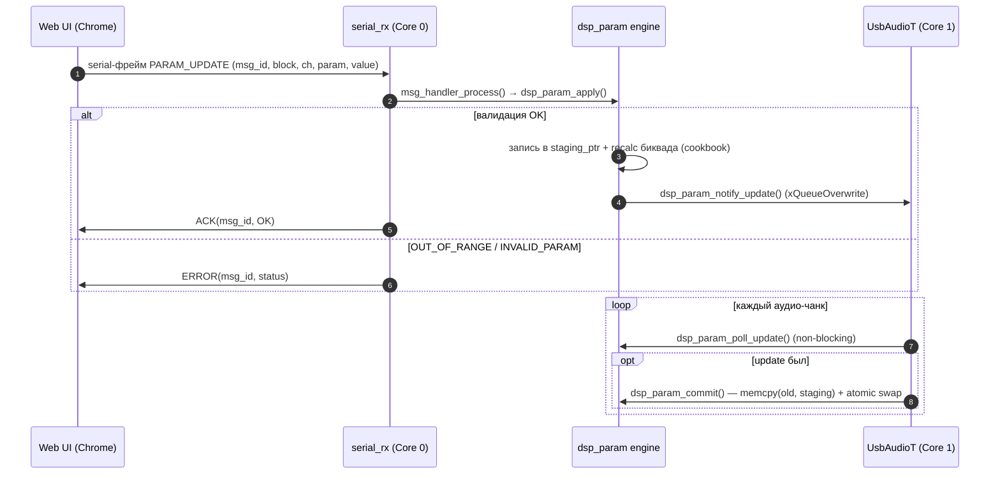
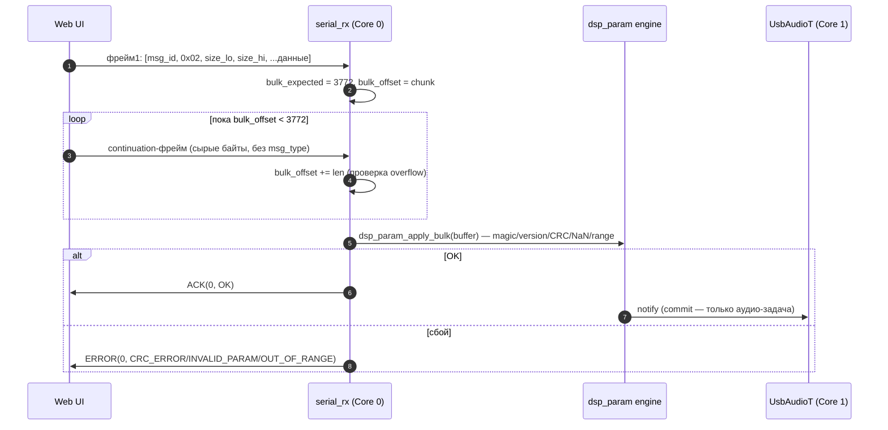
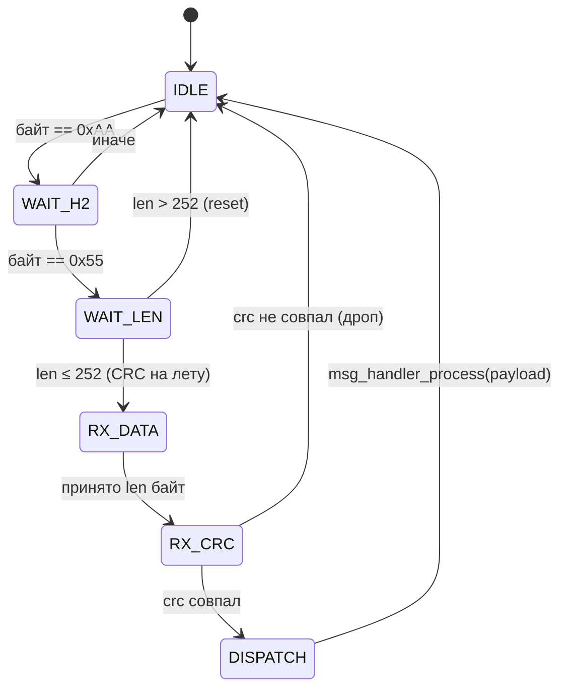
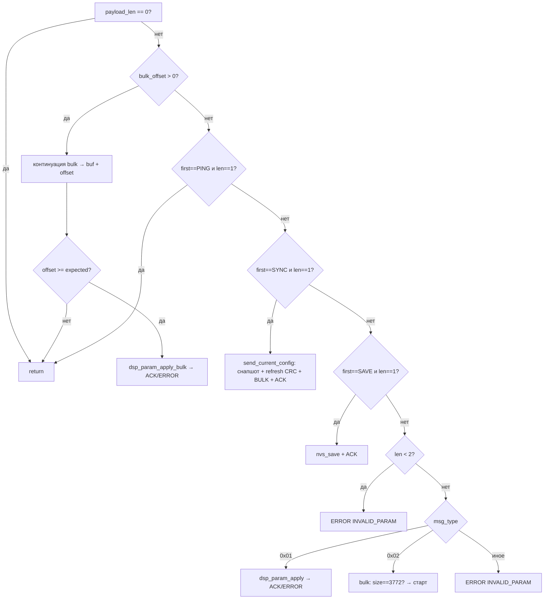

# Архитектура прошивки (ESP32-S3)

Модули: `dq-dsp-firmware/main/` и `dq-dsp-firmware/shared/dsp/`. Сборка: ESP-IDF 6.0.2,
target `esp32s3`, чип ESP32-S3 N16R8 (dual-core Xtensa LX7 @ 240 МГц, 16 МБ flash, 8 МБ PSRAM).

## 1. Потоки и ядра

| Поток/колбэк | Ядро | Приоритет | Стек | Назначение |
|---|---|---|---|---|
| `serial_rx` (`serial_server.c`) | Core 0 | 3 | 4096 | UART-приём, разбор фреймов, `msg_handler_process()` |
| `UsbAudioT` (`usb_audio.c`) | **Core 1** | `configMAX_PRIORITIES - 3` | 4096 | аудио: ring buffer → ASRC → DSP → dual I2S |
| `drift_pi` (esp_timer) | Core 0 (таймер) | — | — | PI-компенсация дрейфа каждые 100 мс |
| UAC `output_cb` | контекст tinyusb | — | — | неблокирующая запись в ring buffer |
| `app_main` | Core 0 | — | — | инициализация, затем завершается |

Пересечение ядер только через **volatile/атомарные** переменные:
- `s_resample_ratio` — пишет `drift_pi` (Core 0), читает аудио-задача (Core 1);
- `s_usb_volume` / `s_usb_mute` — пишут UAC-колбэки, читает аудио-задача;
- телеметрия — аудио-задача постит, serial-задача флашит (`msg_handler_post/flush_telemetry`).

## 2. Аудио-путь

```
Host (UAC 1.0, 24-bit/48k stereo)
  → tinyusb output_cb → ring buffer (192 КБ ≈ 333 мс)
  → UsbAudioT (Core 1):
      xRingbufferReceive → dsp_param_poll_update()? → dsp_param_commit()
      → ASRC (дробный фазовый аккумулятор + линейная интерполяция,
              ratio от PI, ±200 ppm)
      → dsp_pipeline_process(cfg, l, r, out[4])
      → soft_clip (knee 0.85) × master_volume × USB volume
      → int32 MSB-aligned → i2s_audio_write_dual(I2S0, I2S1)
  → 2 × PCM5102A → 4 line outs
```

- Ring buffer защищает от рассинхрона USB-изохрона и I2S; при заполнении > 90 %
  кадры отбрасываются (счётчик `s_overflow_count`) — это страховка, а не основной
  механизм дрейфа.
- Формат на проводе: 24-бит LE → float (нормализация 2^23); на I2S — int32, MSB-aligned,
  PCM5102A защёлкивает старшие 24 бита.

## 3. DSP-конвейер (`shared/dsp/dsp_pipeline.c`)

Побайтово, per-sample, всё в IRAM (`IRAM_ATTR`). Для каждого сэмпла:

1. **Вход (×2)**: `gain → phase_invert → mute → RoomEQ (10 biquads, per-band enable) → PEQ (10 biquads)`.
2. **Маршрутизация (2×4)**: `out[o] = Σ_i in[i] · routing[i][o].gain` для enabled-ячеек.
3. **Выход (×4)**: `PEQ (10) → HP-кроссовер (num_hp_stages) → LP-кроссовер (num_lp_stages) →
   gain → delay (кольцевой буфер, ≤ 960 сэмплов = 10 мс @ 96 кГц) → phase_invert → mute → master_volume`.

Биквад — **Direct Form II Transposed** (коэффициенты в negated-a конвенции, внутренний цикл
только на сложениях). Состояния фильтров — отдельные статические массивы
`biquad_state_t`; при смене коэффициентов не обнуляются — DF-IIT плавно морфирует
под новыми коэффициентами (без кликов на движке слайдера).

Конфиг читается как `const dsp_config_t *` из `dsp_param_get_active()` — атомарная
загрузка указателя.

## 4. Double-buffer параметров (`shared/dsp/dsp_param_update.c`)

Два статических буфера `config_buf_a` / `config_buf_b`; `active_ptr` — `_Atomic`,
`staging_ptr` — обычный указатель.

```
serial/BLE задача:                  аудио-задача:
  dsp_param_apply(msg)                каждый аудио-чанк:
    → валидация len/типа/диапазона       dsp_param_poll_update()?  ← очередь уведомлений
    → запись в staging_ptr               → dsp_param_commit():
    → пересчёт биквадов                     memcpy(old_active, staging)
    → dsp_param_notify_update()             atomic_store(active_ptr, staging)
      (xQueueOverwrite + pending=true)      staging_ptr = old_active; pending=false
```

- **Уведомление** — FreeRTOS-очередь в overwrite-режиме (`xQueueOverwrite`): «последнее
  изменение важнее», очередь не переполняется.
- **Commit — только из аудио-задачи** (фикс аудита H2, коммит `2b27d72`). Раньше
  `dsp_param_apply_bulk` звал `dsp_param_commit()` сам — это давало двойной swap и
  запись в буфер, который аудио-задача в этот момент читала.
- CRC активного конфига никогда не трогается на месте: при SYNC_CONFIG снапшот
  копируется в локальный буфер и CRC обновляется там.

### Валидация параметров

`dsp_param_apply()`: `ble_validate_param_msg_len()` → проверка `target_block/channel/index`
в диапазонах → проверка значения (диапазоны, `isfinite`) → запись в staging →
пересчёт коэффициентов биквада по формулам Audio EQ Cookbook (порт `biquad.ts`).

`dsp_param_apply_bulk()` (3772 байта, `DSP_VERSION`, `DSP_MAGIC`, CRC-32):
1. размер/магия/версия/CRC-32;
2. `num_hp_stages`/`num_lp_stages` ≤ `DSP_MAX_XO_STAGES`, `delay_samples` ≤ 960;
3. **NaN/Inf-guard** (фикс H5): `isfinite` по всем биквад-коэффициентам, гейнам,
   master_volume, drift-коэффициентам + диапазоны gain, зеркалящие per-param путь;
4. если `sample_rate` блоба ≠ `CONFIG_UAC_SAMPLE_RATE` — принудительно ставится
   firmware-частота, а все биквад-коэффициенты стираются в identity (прозрачный
   проход); UI пересчитает коэффициенты при следующем пуше.

## 5. ASRC и PI-компенсация дрейфа (`main/usb_audio.c`)

USB-часы хоста и I2S-часы не совпадают (независимые кристаллы). Вместо дропа/дублей
сэмплов (клики) используется **асинхронный ресемплер**:

- каждые 100 мс `drift_pi` читает заполнение ring buffer, PI-ошибка = `fill − target`
  (target по умолчанию 50 %), выход клэмпится к ±`drift_max_ppm` (по умолчанию ±200 ppm);
- `ratio = 1.0 + ppm/1e6` пишется в `s_resample_ratio`;
- аудио-задача использует фазовый аккумулятор `s_asrc_phase += ratio` и линейную
  интерполяцию между соседними входными сэмплами.

Коэффициенты Kp/Ki/target/max_ppm живут в `dsp_config_t.system` и тюнятся из UI в
режиме реального времени. При смене Kp/Ki интеграл сбрасывается (анти-windup).

## 6. Телеметрия (1 Гц)

Аудио-задача каждую секунду постит `dsp_telemetry_t`:
`dsp_min/max/avg_us`, `blocks_processed`, `buffer_fill_pct`, `correction_ppm`.
Serial-задача в цикле вызывает `msg_handler_flush_telemetry()` и шлёт фрейм
`SERIAL_MSG_TELEMETRY`. UI рисует графики дрейфа/jitter и загрузки.

## 7. Модули (карта файлов)

### `main/`

| Файл | Ответственность |
|---|---|
| `main.c` | `app_main`: NVS → загрузка конфига → `dsp_param_init` → `dsp_pipeline_init` → serial → I2S → USB. `save_config_to_nvs_immediate()` (NVS-сохранение по явной команде). |
| `usb_audio.c` | tinyusb UAC-инициализация, ring buffer, ASRC, PI-drift, аудио-задача, soft_clip, телеметрия. |
| `i2s_audio.c` | dual I2S TX (GPIO 4/5/6 + 16/17/18), 32-битный слот. |
| `serial_server.c` | UART0 115200, байтовая state-machine фреймов, redirect ESP_LOG в `SERIAL_MSG_LOG`, PONG. |
| `Kconfig.projbuild` | GPIO, битрейт, частота, глубина (24 бит). |

### `shared/dsp/`

| Файл | Ответственность |
|---|---|
| `dsp_config.h` | **Канонический layout** `dsp_config_t` (3772 байта, pack 4), memory-mappable из бинарника. |
| `ble_protocol.h` | Типы сообщений, блоки, параметры, статусы, wire-структуры. Зеркало — `types/ble-protocol.ts`. |
| `serial_protocol.h` | Фреймы `0xAA 0x55`, CRC-8, константы. Зеркало — `types/serial-protocol.ts`. |
| `msg_handler.c/.h` | Транспорт-агностичный роутер: PARAM_UPDATE, BULK_CONFIG, PING, SYNC_CONFIG, SAVE_CONFIG, телеметрия. Транспорт предоставляет `msg_transport_t`-колбэки. |
| `dsp_param_update.c/.h` | Double-buffer engine, per-param apply + recalc, bulk-валидация, CRC-32 (IEEE 802.3, полином 0xEDB88320). |
| `dsp_pipeline.c` | Per-sample DSP-конвейер (IRAM). |
| `dsp_telemetry.h` | Структура телеметрии. |

## 8. NVS-персистентность

- Ключ `dsp/config`, namespace `dsp`. На старте: `magic` + `version` проверяются,
  при несовпадении — дефолты.
- Сохранение **только по явной команде** (`SERIAL_MSG_SAVE_CONFIG` или кнопка
  «Save to Device»): flash-write отключает instruction cache на обеих ядрах →
  аудио-глитчи, поэтому автосохранение намеренно убрано.
- При загрузке частота принудительно выравнивается к `CONFIG_UAC_SAMPLE_RATE`,
  чтобы биквады не считались на чужой частоте.

## 10. Диаграммы

### Жизненный цикл параметрического апдейта (двойной буфер)



### Bulk-конфиг (Apply / SYNC_CONFIG)



### RX state-machine serial-фрейма (serial_server.c)



### Обработка payload в msg_handler_process (приоритеты)



## 11. Требования реального времени

- Аудио-задача прибита к Core 1; всё DSP-ядро в IRAM.
- `dsp_param_commit` — memcpy 3772 байт + swap ≈ единицы мкс, выполняется между
  чанками.
- Serial RX — батч-чтение (`uart_read_bytes` один раз на кадр), 256-байтовый буфер.
- Логирование в hot-path (`dsp_param_commit`) — `ESP_LOGV` (не LOGI).
