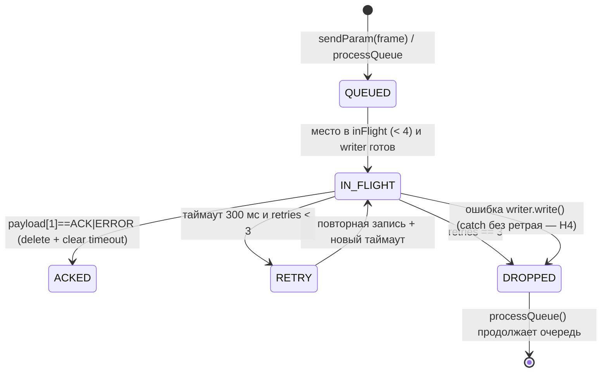
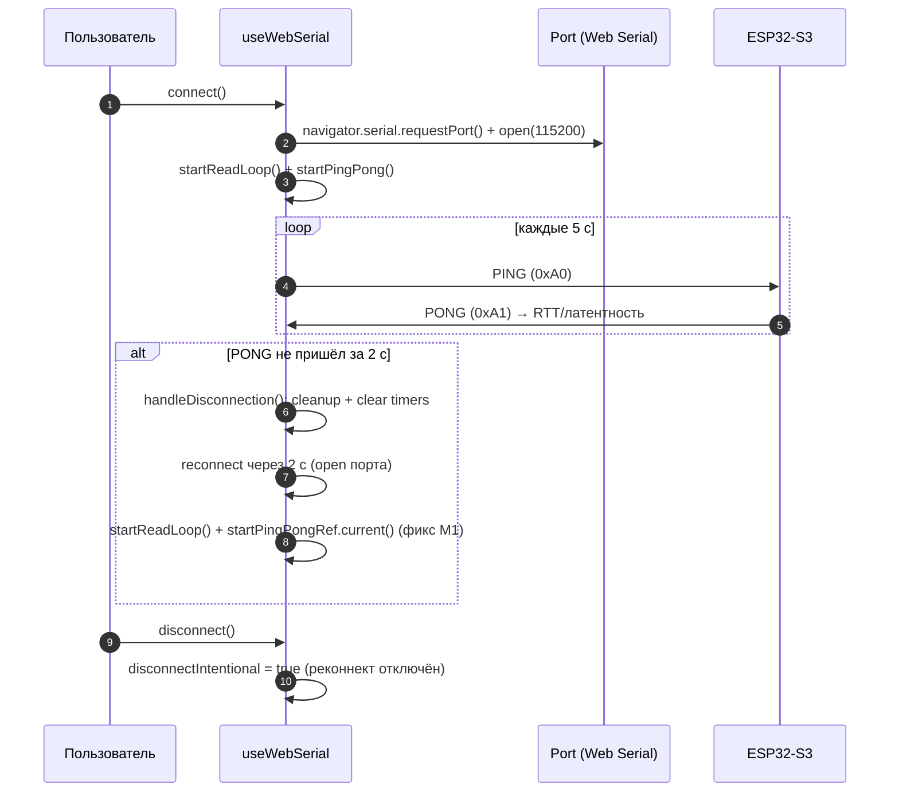
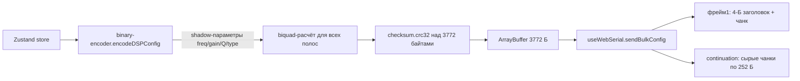

# Архитектура веб-UI (Vite + React 19 + TypeScript)

Одностраничное приложение: редактор DSP-конфига с живой передачей изменений на
устройство по **Web Serial** и офлайн-визуализацией (АЧХ, кроссоверы, Room EQ,
акустические суммы). Сборка: `tsc -b && vite build` → статический SPA в `dist/`.

## 1. Слои

```
┌─────────────────────────────────────────────────────────┐
│ Components (src/components/)                            │
│   layout · controls (Knob, GainSlider, NumericInput…)    │
│   input · output · routing · eq · room-eq · drift ·      │
│   preset · serial · signal-flow · about                  │
└───────────────┬─────────────────────────────────────────┘
                │ читают/пишут стор
┌───────────────▼─────────────────────────────────────────┐
│ Zustand store (src/store/dsp-store.ts)                  │
│   10 слайсов + persist(localStorage, debounce 300 мс)   │
└───────┬───────────────────────────────┬─────────────────┘
        │ подписка                      │ subscribe
┌───────▼──────────────┐   ┌────────────▼─────────────────┐
│ serial-middleware    │   │ useWebSerial hook            │
│ diff prev/curr →     │   │ Web Serial транспорт,        │
│ encodeSerialFrame    │   │ очередь + ACK/retry, bulk RX, │
└───────┬──────────────┘   │ ping/pong, auto-reconnect    │
        │                  └────────────┬─────────────────┘
        │ sendParam(frame)              │ raw-фреймы
        └──────────────────┬─────────────┘
                    browser Web Serial (Chrome/Edge)
                           │
                    ESP32-S3 UART0 (USB-Serial-JTAG)
```

Аудио-путь (UAC) в UI не участвует — это второй USB-порт устройства.

## 2. Store (`src/store/dsp-store.ts`)

Zustand, единый стор `DSPStore` из 10 слайсов (`src/store/slices/`):

| Слайс | Отвечает за |
|---|---|
| `input-slice` | 2 входных канала: gain, mute, phase, PEQ-полосы, Room EQ-полосы |
| `routing-slice` | матрица 2×4 (enabled + gain на ячейку) |
| `output-slice` | 4 выхода: gain, delay, phase, mute, PEQ, кроссовер (HP/LP) |
| `global-slice` | masterVolume, sampleRate, selectedBlock, `applyDeviceConfig()` |
| `preset-slice` | список пресетов, загрузка/сохранение, dirty-статус |
| `link-slice` | link-группы входов и выходов (зеркалирование правок) |
| `serial-slice` | состояние serial-подключения |
| `room-eq-slice` | Room EQ: полосы, measurement, smoothing, target curve, tilt |
| `drift-slice` | PI-коэффициенты ASRC |
| `custom-sum-slice` | пользовательские акустические суммы |

**Persist** (`name: 'esp32-dsp-config'`):
- кастомный `createDebouncedLocalStorage` — запись в localStorage откладывается на
  300 мс после последнего изменения (слайдеры не пишут на каждый pointer-move);
- `partialize` — только данные конфига (без функций и UI-состояния);
- `merge` — миграции старых сохранений: подстановка `roomEqBands`, булевых
  `outputLinks` → `outputLinkGroups`, палитры сумм.

## 3. Serial-middleware (`src/serial/serial-middleware.ts`)

Подписка на изменения стора: `subscribe((state, prevState) => …)`.

- Если `!serialConnected` — ничего не отправляется.
- Если `isApplyingDeviceConfig()` — пропуск (не эхо-обратно конфиг, только что
  полученный от устройства).
- **Diff prev/curr** по каждому поддереву: inputs, outputs, routing, roomEqBands,
  masterVolume; внутри — по полям (enabled/frequency/gain/q/type/mute/phase/delay).
- Два режима отправки:
  - **immediate** — дискретные переключения (mute, phase, enable, type, slope);
  - **debounced 50 мс** — непрерывные слайдеры (gain, freq, Q, delay, masterVolume),
    ключ кэша по `параметр-канал-полоса`, «последнее изменение побеждает».
- Кодировка через `encodeSerialFrame(encodeParamUpdate(...))`.

## 4. Транспорт (`src/hooks/useWebSerial.ts`)

Хук возвращает `{ state, connect, disconnect, sendParam, sendBulkConfig, onStatus,
onLog, onTelemetry, onConfig, requestConfig }`.

Состояние-рефы: `portRef`, `writerRef`, `readerRef`, `inFlightRef` (Map msg_id →
pending), `sendQueueRef`, `ackTimeoutsRef`, `bulkRxBufferRef` и пр.

### Отправка
- `sendParam(frame)` — в очередь; `processQueue` шлёт, пока `inFlight < 4`.
- Каждое сообщение: `sentAt`, `retries: 0`; таймаут ACK 300 мс → ретрай (до 3
  повторных попыток) → удаление из in-flight.
- Ошибка `write` — `catch` удаляет сообщение (см. аудит H4: ретрай при ошибке
  записи ещё не внедрён).

### Приём (`handleRxPayload`)
Приоритеты разбора (после фиксов аудита):
1. **Активный bulk-приём** → всё в буфер без разбора сигнатур (фикс H3);
2. `PONG` — RTT/latency;
3. `LOG` — текст в консоль;
4. `TELEMETRY` — `decodeTelemetry` → графики;
5. `ACK/ERROR` — `inFlightRef.delete`, очистка таймаута, нотификация подписчиков;
6. `BULK_CONFIG` первый фрейм — аллокация `bulkRxBuffer`, сборка чанков;
7. континуация с таймаутом 5 с (`BULK_RX_TIMEOUT_MS`) — отмена «залипшей» передачи.

### Health-мониторинг и reconnect
- `startPingPong()`: PING каждые 5 с, PONG-таймаут 2 с → `handleDisconnection()`.
- `handleDisconnection()`: чистка, авто-реконнект через 2 с; после успешного
  открытия порта — `startReadLoop()` **и** перезапуск `startPingPongRef.current()`
  (фикс M1: мониторинг не «умирал» после реконнекта).
- `startPingPong` и `handleDisconnection` взаимозависимы — вызов через ref, чтобы
  не создавать круговую зависимость useCallback.

### Bulk-отправка (`sendBulkConfig`)
`encodeDSPConfig(config, drift)` → байты; первый фрейм с 4-байтным заголовком
`[msg_id=0, 0x02, size_lo, size_hi]`, затем сырые чанки по 252 байта.

## 5. Кодирование/декодирование конфига (`src/export/`)

| Файл | Роль |
|---|---|
| `binary-encoder.ts` | `encodeDSPConfig(config, drift)` → `ArrayBuffer` 3772 байта по layout из `wire-protocol.md` |
| `binary-decoder.ts` | `decodeDSPConfig(buffer)` → `DSPConfig` (с полями блока × канал) |
| `checksum.ts` | CRC-32 IEEE 802.3 (зеркало FW) |

Ключевое: encoder заново вычисляет **все биквад-коэффициенты** из shadow-параметров
(freq/gain/Q/type) перед записью, поэтому пресет/блоб самодостаточен — устройство
не пересчитывает фильтры при bulk-применении (только валидирует и затирает
коэффициенты при рассинхроне частоты).

## 6. Пресеты и файлы (`src/utils/preset-io.ts`, `preset-slice.ts`)

- Пресеты хранятся в localStorage (внутри persist) + экспорт/импорт JSON.
- Dirty-статус: Saved / Modified / Unsaved относительно загруженного пресета.
- `applyDeviceConfig()` (global-slice): подставляет конфиг с устройства в стор,
  оборачивая в `try/finally` — флаг `_applyingDeviceConfig` гарантированно
  сбрасывается (фикс M3), иначе middleware навсегда перестал бы слать diff.

## 7. DSP-вычисления в UI (`src/dsp/`, `src/utils/`)

- `biquad.ts` — Audio EQ Cookbook (порт в FW `dsp_param_update.c`).
- `crossover.ts` — каскады Linkwitz-Riley/Butterworth.
- `frequency-response.ts` — комплексная АЧХ цепочек, кроссоверов, сумм.
- `auto-eq.ts` — подбор полос под Room measurement (flat/Harman/tilt).
- `rew-parser.ts` — импорт измерений REW.
- `smoothing.ts`, `target-curves.ts`, `colors.ts`, `format.ts`, `math.ts`.

## 8. Компоненты

- `components/controls/` — переиспользуемые виджеты (Knob, GainSlider, NumericInput,
  MuteButton, PhaseButton, FilterTypeSelect, DelayInput, LinkButton).
- `components/eq/` — PEQEditor, EQBandHandle, FrequencyResponseGraph,
  AllChannelsResponseChart, CustomSumEditor.
- `components/room-eq/` — RoomEQPanel + RoomEQChart.
- `components/output/` — OutputStage, OutputChannelStrip, CrossoverPanel,
  LinkPicker, CopyPicker.
- `components/serial/` — SerialConsole, DriftChart, JitterChart.
- `components/layout/` — AppShell, Toolbar, SignalFlowNav, SerialStatusBar,
  BrowserSupportBanner, AppFooter.
- `components/signal-flow/` — интерактивная схема сигнального тракта с
  LevelMeter'ами.

## 9. Поддержка браузеров

Web Serial доступен в Chrome/Edge/Brave/Opera на десктопе. `useSerialSupport.ts`
детектит отсутствие API (Firefox/Safari/мобайл) и небезопасный контекст (HTTP) —
`BrowserSupportBanner` показывает причину, кнопка Connect блокируется. Без железа
UI полностью работает офлайн (кроме live-пуша).

## 10. Диаграммы

### Retry-машина отправки (ACK_TIMEOUT_MS=300, MAX_RETRIES=3, IN_FLIGHT=4)



### Приоритет разбора входящего payload (handleRxPayload)

```mermaid
flowchart TD
    P[payload.length == 0?] -->|да| R[return]
    P -->|нет| T1{payload[0] == PONG?}
    T1 -->|да| LT[RTT → latency]
    T1 -->|нет| T2{payload[0] == LOG?}
    T2 -->|да| LG[decode text → logCallbacks]
    T2 -->|нет| T3{payload[0] == TELEMETRY?}
    T3 -->|да| TM[decodeTelemetry → graphs]
    T3 -->|нет| T4{len>=3 и payload[1] == ACK/ERROR?}
    T4 -->|да| AK[inFlight.delete + clear timeout + statusCallbacks + processQueue]
    T4 -->|нет| T5{len>=4 и payload[1] == BULK_CONFIG?}
    T5 -->|да| BS[bulkRxBuffer = new Uint8Array(totalSize) + первый чанк]
    T5 -->|нет| T6{bulkRxBuffer активен?}
    T6 -->|да| BC[continuation: set(chunk, offset) + таймаут 5 с]
    T6 -->|нет| R
```

### Подключение → мониторинг → реконнект



### Экспорт конфига в бинарник



## 11. Тесты и проверки

- `vitest` (2 файла: `binary-encoder`, `biquad`) — 17 тестов.
- `eslint .` — весь проект, 0 предупреждений.
- `npm run build` = `tsc -b && vite build`.
- Покрытие тонкое: декодер, checksum, retry-логика и слайсы тестами не покрыты
  (см. аудит, раздел «Оставшиеся рекомендации»).
